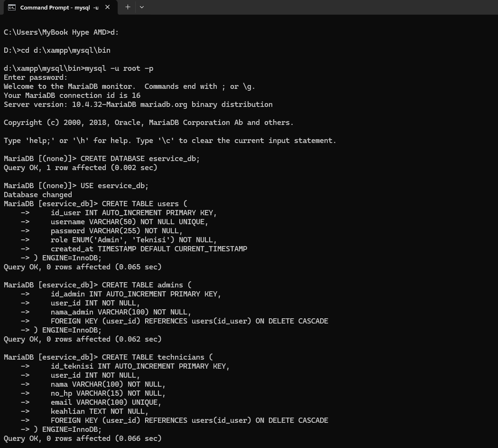
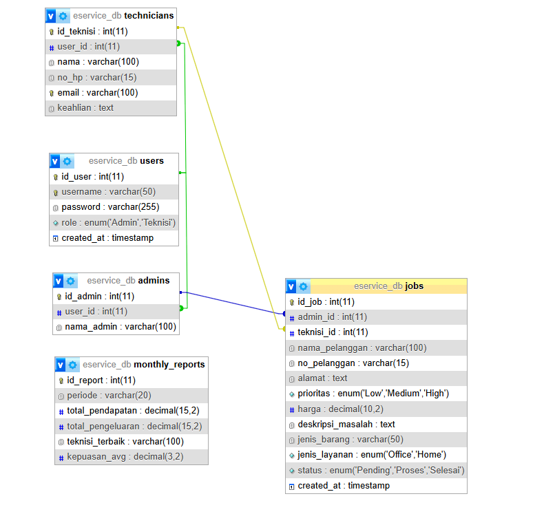

### Penjelasan Mendalam Physical Database Design

Dokumentasi ini menjelaskan implementasi fisik dari database `eservice_db` berdasarkan skrip SQL yang telah dieksekusi dan skema relasional yang dihasilkan.

#### **A. Tabel JOBS: Pusat Integrasi Sistem**
Tabel `jobs` berfungsi sebagai entitas pusat yang menghubungkan seluruh aktor dalam sistem.
* **Relasi Admin-ke-Job**: Kolom `admin_id` dikunci dengan *Foreign Key* ke `admins(id_admin)`. Hal ini menjamin akuntabilitas data, di mana setiap pekerjaan harus memiliki validator (Admin) yang bertanggung jawab atas input data awal.
* **Relasi Teknisi-ke-Job**: Kolom `teknisi_id` bersifat *Nullable* (dapat dikosongkan sementara). Hal ini merepresentasikan kondisi dunia nyata di mana sebuah pekerjaan mungkin belum langsung memiliki teknisi saat pertama kali diinput.
* **Constraint ON DELETE SET NULL**: Pada relasi teknisi, sistem menggunakan `SET NULL`. Artinya, jika seorang teknisi dihapus dari sistem, riwayat pekerjaannya tetap tersimpan di tabel `jobs` dengan kolom teknisi menjadi kosong. Ini krusial untuk menjaga akurasi laporan keuangan historis.

#### **B. Arsitektur Tabel Laporan (Monthly Reports)**
Pada tampilan visual (seperti PHPMyAdmin/DBeaver), tabel `monthly_reports` terlihat tidak memiliki garis penghubung ke tabel lain. Hal ini merupakan keputusan desain arsitektur yang disengaja berdasarkan prinsip berikut:
* **Logika Snapshot (Data Historis)**: Tabel laporan dirancang untuk menyimpan hasil statis dari masa lalu. Jika tabel ini dihubungkan secara ketat dengan *Foreign Key* ke transaksi aktif di tabel `jobs`, maka setiap perubahan atau penghapusan data transaksi akan merusak integritas laporan masa lalu.
* **Efisiensi Agregasi**: Data pada `monthly_reports` dihasilkan melalui *Query Agregasi* (perhitungan kolektif). Hubungan antara tabel `jobs` dan `monthly_reports` adalah hubungan **Logika Bisnis**, bukan hubungan fisik *Real-time*. Dengan tidak menghubungkannya secara fisik, beban kerja database (I/O) menjadi lebih ringan saat melakukan input pekerjaan baru.

#### **C. Implementasi Keamanan dan Integritas Data**
Desain fisik ini mengimplementasikan beberapa fitur tingkat lanjut untuk menjamin keamanan data:
* **Normalisasi Spesialisasi**: Pemisahan tabel `users`, `admins`, dan `technicians` dengan relasi `1:1` memastikan bahwa kredensial login terpusat, namun profil detail masing-masing peran tetap terisolasi.
* **Constraint ON DELETE CASCADE**: Diterapkan pada profil Admin dan Teknisi terhadap tabel User. Jika sebuah akun User dihapus, maka secara otomatis profil terkait di tabel lain akan terhapus, menjaga database tetap bersih (tidak ada data yatim piatu).
* **Presisi Finansial**: Penggunaan `DECIMAL(10,2)` dan `DECIMAL(15,2)` dipilih untuk menghindari kesalahan pembulatan angka yang sering terjadi pada tipe data `FLOAT` atau `DOUBLE` dalam perhitungan keuangan dalam jumlah besar.

#### **D. Konsistensi Antar Skema**
Seluruh penamaan kolom (seperti `id_user`, `id_admin`, `id_job`) telah diselaraskan di seluruh dokumen, mulai dari Data Dictionary, ERD, hingga skrip SQL yang dijalankan di terminal MariaDB. Hal ini membuktikan bahwa pengembangan sistem dilakukan dengan perencanaan yang matang dari tahap logika hingga tahap fisik.